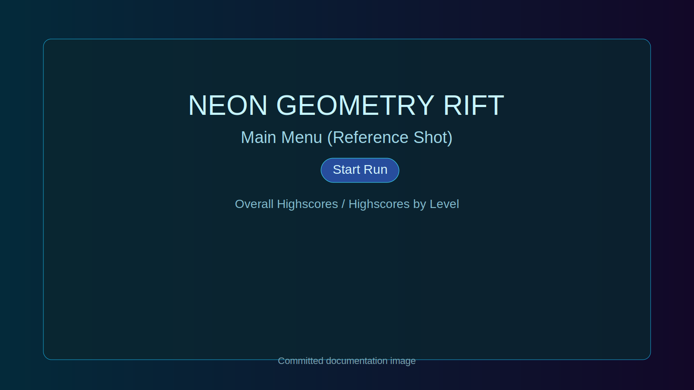
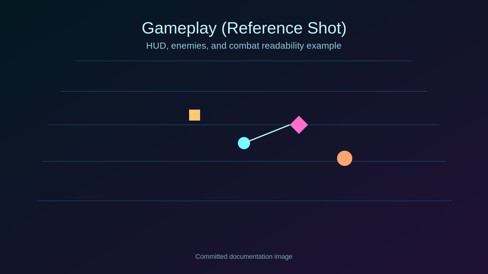

# Neon Geometry Rift

A fast-paced **Geometry Wars-inspired twin-stick survival shooter** built with **TypeScript**, **Canvas 2D**, and a dynamic **Three.js** background layer.

You pilot a neon strike craft through escalating geometric arenas, draft roguelike relics between levels, fight mutating enemy waves, and chase persistent highscores.

---

## Screenshots

### Main Menu / HUD


### In-Game Combat


## Features

- **Twin-stick arcade combat** (move + independent aim/fire)
- **Multi-level progression** with level scaling and recurring boss cadence
- **Roguelike relic drafting** between levels (stacking run modifiers)
- **Level mutators** (anomaly rules that alter pacing/difficulty/rewards)
- **Multiple enemy archetypes** with distinct movement/combat behavior
- **Active abilities**:
  - Dash
  - Phase Pulse
  - Overdrive
  - Cannon Blast
- **Powerup ecosystem** including rapid fire, shield, scatter, drone, arc chaining, gravity field, and more
- **Persistent highscores** using IndexedDB with localStorage fallback
- **WebAudio synth SFX + combat music loop** (with mute support)
- **Cinematic transitions** (warp-jump effects, impact flashes, ripple distortion)
- **Layered visuals**: 2D gameplay + Three.js background + neon post effects

---

## Controls

| Action | Input |
|---|---|
| Move | `WASD` or Arrow Keys |
| Aim | Mouse |
| Fire | Hold Left Mouse or `Space` |
| Dash | `Shift` |
| Phase Pulse | `Q` |
| Cannon Blast | `E` |
| Overdrive | `R` |
| Pause | `P` |
| Fullscreen | `F` |
| Mute Audio | `M` |

---

## Gameplay Systems

### 1) Core Loop
1. Start run from menu.
2. Survive enemy waves and hit kill targets.
3. Clear level, draft one relic.
4. Warp to next level with a new mutator profile.
5. Survive until defeat, then save score.

### 2) Enemies
The game includes standard + advanced enemy archetypes, with special handling for boss levels. Enemy values and composition are level-driven from config and scaled dynamically over cycles.

### 3) Relics (Roguelike Draft)
Relics are offered in a 3-choice draft between levels and stack up to rarity-specific limits. They modify stats such as:
- fire rate
- movement speed
- dash cooldown
- max health/shield
- score multiplier
- cannon strength
- powerup drop chance

### 4) Mutators
Each level can roll mutators that influence enemy speed/HP/spawn cadence and reward pressure. This creates different run textures even when revisiting level themes.

### 5) Health & Shield Model
- Shield absorbs incoming damage first and can regenerate.
- Health is the failure condition (run ends at zero).
- Sustain can be improved through pickups/relic effects.

### 6) Highscores
- Stored primarily in IndexedDB.
- Falls back to localStorage where IndexedDB is unavailable.
- Includes overall top scores + per-level leaderboard views.

---

## Project Structure

```text
.
├── index.html
├── styles.css
├── src
│   ├── main.ts                  # Core gameplay loop + rendering + systems orchestration
│   ├── config
│   │   └── levels.json          # Base level definitions
│   └── game
│       ├── audio.ts             # WebAudio synthesis and music sequencing
│       ├── background3d.ts      # Three.js background scene/effects
│       ├── dom.ts               # DOM element bindings
│       ├── highscores.ts        # Score persistence + queries
│       ├── levels.ts            # Runtime level scaling logic
│       └── types.ts             # Shared type definitions
├── package.json
└── tsconfig.json
```

---

## Getting Started

### Prerequisites
- Node.js 18+
- npm 9+

### Install
```bash
npm install
```

### Run (Development)
```bash
npm run dev
```

### Type-check
```bash
npm run typecheck
```

### Production Build
```bash
npm run build
```

### Preview Production Build
```bash
npm run preview
```

---


## Maintenance Note

- `src/main.ts` was updated in the previous commit only to fix a malformed block inside `drawBackground()` that caused TypeScript/esbuild parse failures (`Unexpected end of file` / missing `}`).
- No gameplay mechanic was intentionally changed in that edit; the goal was to restore a valid build so the README work could ship with a runnable project.

---

## Tech Stack

- **TypeScript**
- **Vite**
- **Canvas 2D API**
- **Three.js**
- **WebAudio API**
- **IndexedDB / localStorage**

---

## Notes

- This game is inspired by arcade twin-stick shooters and emphasizes neon readability, responsive movement, and high action density.
- All effects, entities, and core gameplay logic are generated/procedural in-code (no external art/sound asset pipeline required).

